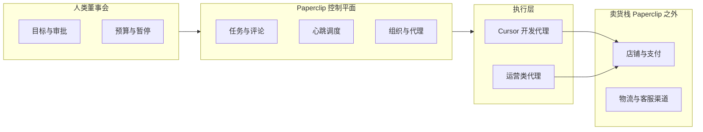

# Paperclip + Cursor 独立站卖货：落地计划

Status: 运营编排计划 + 仓库内可导入示例  
Date: 2026-04-03  
Audience: 董事会 / 自建 DTC 的 Paperclip 操作者

## 与仓库交付物的关系

| 内容 | 位置 |
|------|------|
| 可导入公司包（CEO / cursor-dev / ops-content + 项目与种子任务） | [examples/dtc-indie-store/](../../examples/dtc-indie-store/) |
| 导入后创建目标树脚本 | [scripts/bootstrap-dtc-example-goals.mjs](../../scripts/bootstrap-dtc-example-goals.mjs) |
| 导入与 CLI | [docs/guides/board-operator/importing-and-exporting.md](../../docs/guides/board-operator/importing-and-exporting.md) |
| 本地 URL 备忘 | [doc/URLS.md](../URLS.md) |
| 开发重启 / 嵌入式库修复 | [scripts/restart-dev.sh](../../scripts/restart-dev.sh)、`pnpm dev:restart`、`pnpm dev:restart:db`，见 [AGENTS.md](../../AGENTS.md) |
| Cursor/Claude PATH（IDE 子进程） | [server/src/prepend-user-local-bin-path.ts](../../server/src/prepend-user-local-bin-path.ts)、[scripts/dev-runner.ts](../../scripts/dev-runner.ts) |

本计划**不要求**改动 Paperclip 核心产品语义；商店与收款仍在 Paperclip 外完成。若需云端 Cursor 适配器，见 [2026-02-23-cursor-cloud-adapter.md](./2026-02-23-cursor-cloud-adapter.md)。

---

## 目标架构（职责划分）



- **Paperclip**：公司、目标/项目/任务（issues）、单负责人 checkout、心跳、成本、预算硬停、活动审计；沟通模型为任务 + 评论。见 [SPEC-implementation.md](../SPEC-implementation.md)、[agents-runtime.md](../../docs/agents-runtime.md)。
- **Cursor**：内置 **`cursor`** 适配器调用本机 Cursor Agent CLI；`cwd` 指向店铺/站点代码仓。见 [packages/adapters/cursor-local](../../packages/adapters/cursor-local)。
- **独立站**：域名、商品、支付、税务与履约在 **Shopify / WooCommerce / 自研 + Stripe** 等完成；Paperclip V1 不含营收账本与知识库子系统（SPEC-implementation 5.2）。

---

## 路线 A vs 路线 B

**路线 A — SaaS 建站（Shopify 等）**

- Cursor 主仓库：主题、Liquid/片段、店铺脚本、营销落地页。
- 优点：支付与合规平台承担较多；上线快。缺点：定制受平台约束。

**路线 B — 自研站点（如 Next.js + Stripe）**

- Cursor `cwd` 指向应用 monorepo。
- 优点：自由度最高。缺点：PCI/税务/风控等需自行妥善处理。

选定后在 [examples/dtc-indie-store/STORE_STACK.md](../../examples/dtc-indie-store/STORE_STACK.md) 记录决策；顶层 **goal** 与 issue 尽量可沿 parent 链追溯到公司使命（[PRODUCT.md](../PRODUCT.md)）。

---

## 在 Paperclip 里「开公司」

1. **部署**：本地 `pnpm dev`（`local_trusted`）；生产见 [DEPLOYMENT-MODES.md](../DEPLOYMENT-MODES.md)。
2. **公司与目标**：创建 company → goal 层级 → project（站点 MVP / 增长 / 内容 SEO）。
3. **代理分工**：工程用 **`cursor`**；运营可用 **`claude_local` / `codex_local` / `http`**；可选 CEO 只做分解与评论，敏感动作走审批。
4. **心跳**：开发侧优先 **分配唤醒**，避免空转；运营侧可定时 + 任务驱动（[agents-runtime.md](../../docs/agents-runtime.md)）。
5. **任务模型**：单 issue 单负责人；`in_progress` 需 atomic checkout；代理可用 `paperclip` skill / API 回写。
6. **预算**：公司及代理月度预算；硬停防 token 黑洞。

**快速导入示例公司**

```sh
pnpm paperclipai company import ./examples/dtc-indie-store \
  --target new \
  --new-company-name "我的 DTC 独立站" \
  --include company,agents,projects,tasks \
  --yes
pnpm bootstrap:dtc-goals "<companyId>"
```

导入后：在 UI 为 **cursor-dev** 设置 **`cwd` 绝对路径**、**Test environment**；按需绑定 `ANTHROPIC_API_KEY` / `PAPERCLIP_API_KEY`。细节见 [examples/dtc-indie-store/README.md](../../examples/dtc-indie-store/README.md)。

---

## Cursor 对接检查清单

- 本机可运行 Cursor Agent CLI（默认类似 `agent -p --output-format stream-json`）。
- 适配器中配置 **`cwd`**、可选 **`instructionsFilePath`**（如仓库 `AGENTS.md`）。
- 若本机 `claude` 只在 NVM 下：确保 Paperclip 进程能解析命令（已用 `prepend-user-local-bin-path` + `~/.local/bin/claude` 链时仍建议重启 `pnpm dev`）。
- 需要 API 时为公司创建 **agent API key**，勿提交到 Git。

---

## 「AI 员工运营」边界

**可做**：文案、上架说明、SEO 结构、简单分析脚本、店铺 API 集成、issue 驱动迭代。  
**不可单独交给代理**：商户资质、收款合规、物流与退换货、广告政策、品牌与定价。  
**数据**：订单与客户 PII 勿写入 Paperclip 评论。

---

## 建议里程碑

1. 选定路线 A 或 B，打通最小可下单路径。
2. Paperclip company + 顶层 goal + 首个 project。
3. 配置 **1 个 Cursor 开发代理**，跑通 assign → heartbeat → 提交/PR。
4. 增加 **1 个运营向代理**，处理内容与上架类 issue。
5. 开启预算与审批，再提高心跳与自动化频率。

---

## CLI 备忘

- 控制平面命令：[docs/cli/control-plane-commands.md](../../docs/cli/control-plane-commands.md)
